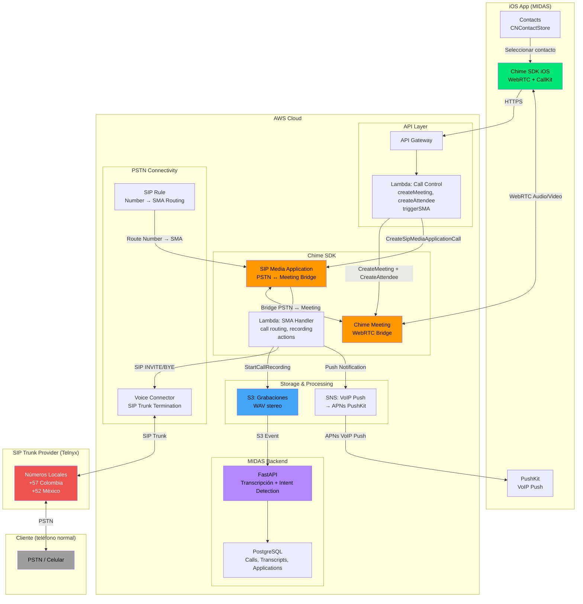
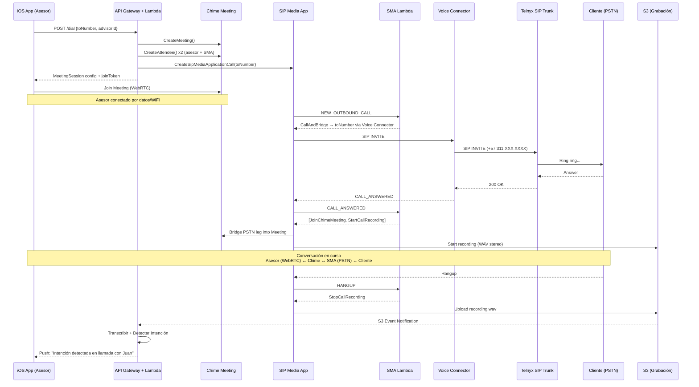
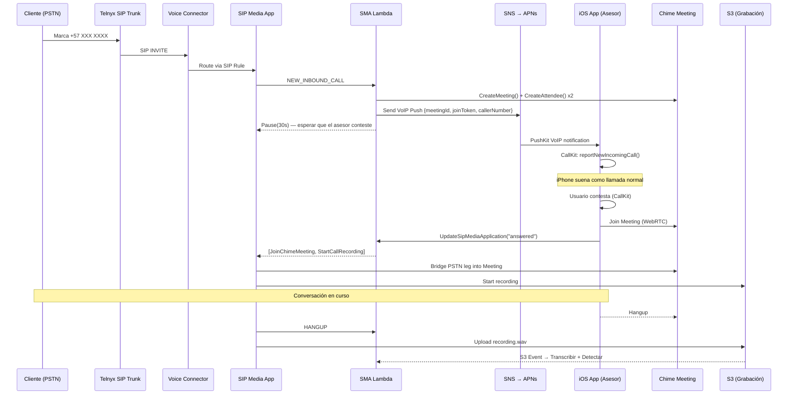

# Arquitectura VoIP — AWS Chime SDK + PSTN

## Diagrama General

## Flujo: Llamada Saliente

## Flujo: Llamada Entrante

## Recursos AWS Necesarios (CDK Stack)

| Recurso | Servicio | Propósito |
|---------|----------|-----------|
| SIP Media Application | Chime SDK Voice | Controla flujo de llamadas PSTN |
| SMA Lambda Handler | Lambda | Lógica de routing, recording, bridging |
| SIP Rule | Chime SDK Voice | Asocia números → SMA |
| Voice Connector | Chime SDK Voice | Termina SIP trunk de Telnyx |
| Phone Numbers | Telnyx | Números locales CO/MX (no disponibles nativos en Chime) |
| Call Control Lambda | Lambda | API para iOS: /dial, /answer, /hangup |
| API Gateway | API Gateway | Expone endpoints HTTPS para iOS |
| S3 Bucket | S3 | Almacena grabaciones WAV |
| SNS Topic | SNS | Envia VoIP push a APNs para llamadas entrantes |
| DynamoDB Table | DynamoDB | Estado de llamadas activas (meeting → advisor mapping) |

## Notas Importantes

1. **Colombia/México**: Chime no ofrece números nativos. Se usa Telnyx como SIP trunk provider con números locales (+57, +52) conectados via Voice Connector.
2. **Grabación**: Server-side en Chime (StartCallRecording action). Audio se almacena en S3 como WAV stereo (canal izquierdo = entrante, derecho = saliente).
3. **iOS SDK**: `amazon-chime-sdk-ios` via SPM. WebRTC-based, soporta CallKit nativo.
4. **PushKit**: Obligatorio para llamadas entrantes. APNs VoIP push despierta la app incluso cerrada.
5. **Costo estimado**: ~$0.008/min (Chime audio) + ~$0.007/min (Telnyx PSTN Colombia) = ~$0.015/min total.

Última actualización: 2026-04-13
