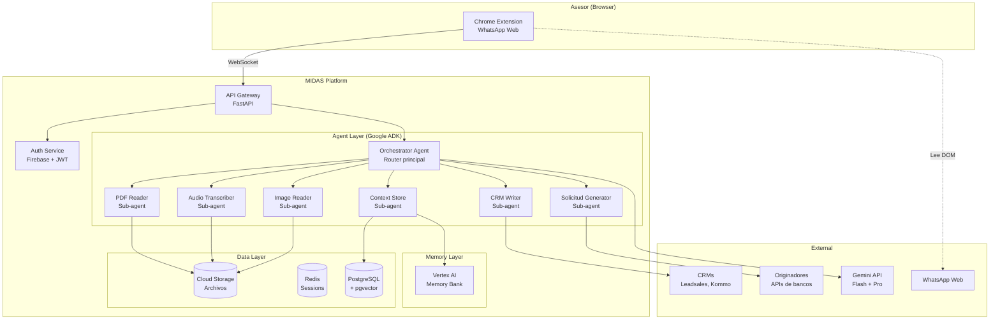
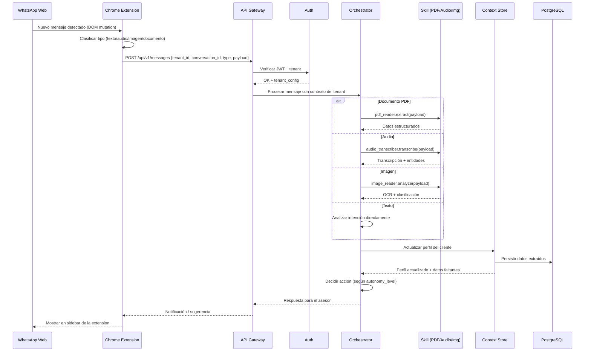

# MIDAS Agent Platform — Product & Technical Specification

## Contexto

MIDAS evoluciona de ser un sistema de captura pasiva de conversaciones a convertirse en una **plataforma de agentes de IA multi-tenant** para asesores financieros independientes. Inspirado en el modelo OpenClaw (agente personal autónomo con skills modulares), MIDAS Agent es un asistente que vive donde el asesor ya trabaja (WhatsApp), ejecuta tareas operativas de forma autónoma, y se personaliza por asesor.

Este documento define la visión de producto, arquitectura técnica, skills del agente, modelo multi-tenant, y plan de implementación. El framework base es **Google Agent Development Kit (ADK)**.

## Contenido

### 1. Visión de Producto

#### 1.1 Problema

Los asesores comerciales de vivienda y crédito vehicular en Colombia y Miami pierden el 65-72% de su tiempo en tareas operativas: recolectar datos del cliente por WhatsApp, llenar solicitudes de crédito manualmente, organizar documentos, dar seguimiento a clientes, y comparar productos financieros. Su stack tecnológico es primitivo (WhatsApp + Excel + libreta) y los CRMs tradicionales fallan porque imponen doble data entry y se perciben como herramientas de vigilancia gerencial.

#### 1.2 Solución

MIDAS Agent es un **agente de IA personal** que cada asesor suscrito recibe al unirse a la plataforma. El agente:

- Vive dentro de WhatsApp (vía Chrome Extension sobre WhatsApp Web)
- Observa pasivamente las conversaciones (con consentimiento de ambas partes)
- Ejecuta tareas operativas de forma autónoma usando skills especializados
- Aprende el contexto y preferencias de cada asesor con el tiempo
- Se conecta a CRMs y originadores downstream

El asesor no cambia su comportamiento. MIDAS trabaja silenciosamente en segundo plano y entrega resultados tangibles: solicitudes pre-llenadas, documentos organizados, recordatorios de seguimiento, transcripciones de audio, y análisis de imágenes de documentos.

#### 1.3 Modelo Mental: OpenClaw para Asesores Financieros

| Concepto OpenClaw | Equivalente MIDAS Agent |
|---|---|
| SOUL.md (personalidad) | Perfil del agente configurable por asesor (tono, idioma, nivel de autonomía) |
| Skills (carpetas con SKILL.md) | Skills financieros especializados (leer PDF, transcribir audio, generar solicitud) |
| Gateway (multi-canal) | Chrome Extension como gateway principal, WhatsApp como canal de entrega |
| Workspace (archivos locales) | Tenant Storage aislado por asesor en la nube |
| Heartbeat (tareas autónomas) | Scheduler para seguimientos automáticos, alertas, y tareas programadas |

#### 1.4 Propuesta de Valor

**Para el asesor (usuario):** "Tu asistente personal que nunca duerme. Lee tus chats, organiza tus documentos, llena tus solicitudes, y te recuerda a quién darle seguimiento — gratis."

**Para el originador/lender (cliente de pago):** "Recibe solicitudes de crédito pre-calificadas y completas, generadas directamente desde la conversación real entre asesor y cliente. Paga solo por solicitud calificada."

---

### 2. User Personas

#### 2.1 Asesor Comercial — Colombia

- **Nombre arquetipo:** Carlos, 34 años, Bogotá
- **Experiencia:** 5 años vendiendo crédito hipotecario y vehicular
- **Volumen:** 15-25 clientes activos/mes, cierra 4-6
- **Stack actual:** WhatsApp personal + Excel + libreta física
- **Pain principal:** Pasa 3-4 horas diarias copiando datos de WhatsApp a formularios
- **Motivación:** Cerrar más negocios sin contratar asistente humano
- **Miedo:** Que le roben su cartera de clientes, que lo vigilen

#### 2.2 Asesor Comercial — Miami

- **Nombre arquetipo:** Andrea, 38 años, Doral
- **Experiencia:** 8 años en real estate, 3 en lending
- **Volumen:** 10-15 clientes activos/mes, cierra 3-5
- **Stack actual:** WhatsApp + Encompass/Calyx + email
- **Pain principal:** Clientes latinos prefieren WhatsApp pero el pipeline exige formularios en inglés
- **Motivación:** Atender más clientes latinos sin duplicar trabajo de traducción y data entry
- **Miedo:** Compliance (RESPA, TILA), perder licencia

---

### 3. Skills del Agente

Cada skill es una unidad autónoma con instrucciones, tools, y configuración. Siguiendo el patrón OpenClaw (carpeta + SKILL.md), cada skill se registra en el Agent ADK como un tool o sub-agente.

#### 3.1 Skills Core (MVP)

##### Skill: Leer PDFs (`pdf-reader`)

- **Descripción:** Extrae texto, tablas, y datos estructurados de documentos PDF que el cliente o asesor comparten por WhatsApp
- **Casos de uso:** Extractos bancarios, certificados laborales, declaraciones de renta, avalúos, fichas técnicas de vehículos
- **Input:** Archivo PDF recibido en chat de WhatsApp
- **Output:** Datos estructurados en JSON + resumen en lenguaje natural
- **Herramientas ADK:** Function tool con PyMuPDF/pdfplumber para extracción, Gemini Vision para PDFs escaneados
- **Prioridad:** P0

##### Skill: Transcribir Audios (`audio-transcriber`)

- **Descripción:** Transcribe notas de voz de WhatsApp a texto y extrae datos relevantes (montos, plazos, nombres, intenciones)
- **Casos de uso:** Cliente envía audio explicando su situación financiera, asesor deja nota de voz con instrucciones
- **Input:** Archivo de audio (opus/ogg de WhatsApp)
- **Output:** Transcripción completa + entidades extraídas + resumen ejecutivo
- **Herramientas ADK:** Gemini con capacidad de audio nativo, o Whisper como fallback
- **Prioridad:** P0

##### Skill: Leer Imágenes (`image-reader`)

- **Descripción:** Analiza imágenes de documentos, capturas de pantalla, y fotos enviadas por WhatsApp para extraer información
- **Casos de uso:** Foto de cédula, foto de recibo de nómina, captura de pantalla de cotización, foto de fachada de inmueble
- **Input:** Imagen (jpg/png) recibida en chat
- **Output:** Datos extraídos en JSON + texto OCR + clasificación del tipo de documento
- **Herramientas ADK:** Gemini Vision API (nativo en ADK)
- **Prioridad:** P0

##### Skill: Almacenar Contexto (`context-store`)

- **Descripción:** Mantiene un perfil vivo de cada cliente del asesor, actualizándose automáticamente con cada interacción
- **Casos de uso:** Recordar que Juan mencionó que gana $8M COP hace 3 semanas, que María prefiere cuotas bajas, que Pedro ya envió su cédula
- **Input:** Eventos de conversación (mensajes, documentos, audios procesados)
- **Output:** Perfil del cliente actualizado, timeline de interacciones, datos pendientes
- **Herramientas ADK:** VertexAI Memory Bank para persistencia + Session State para contexto activo
- **Prioridad:** P0

##### Skill: Escribir en CRM (`crm-writer`)

- **Descripción:** Sincroniza datos del cliente y estado del deal con el CRM del asesor o del originador
- **Casos de uso:** Crear lead en Leadsales, actualizar pipeline en Kommo, enviar solicitud a sistema del banco
- **Input:** Datos estructurados del cliente + estado del proceso
- **Output:** Confirmación de escritura + ID del registro creado/actualizado
- **Integraciones iniciales:** Leadsales API, Kommo API, webhook genérico para otros CRMs
- **Herramientas ADK:** Function tools con HTTP clients, MCP connectors
- **Prioridad:** P1

#### 3.2 Skills Avanzados (Post-MVP)

##### Skill: Generar Solicitud Pre-llenada (`solicitud-generator`)

- **Descripción:** Genera un borrador de solicitud de crédito usando datos acumulados del cliente en el context-store
- **Input:** Perfil del cliente + tipo de producto (hipotecario/vehicular) + entidad destino
- **Output:** Formulario pre-llenado en PDF + lista de datos faltantes + confianza por campo (%)
- **Prioridad:** P1

##### Skill: Seguimiento Inteligente (`smart-followup`)

- **Descripción:** Detecta clientes que se están "enfriando" y genera recordatorios o mensajes sugeridos para el asesor
- **Input:** Timeline de conversación + reglas de negocio (ej: si no hay mensaje en 3 días, alertar)
- **Output:** Notificación al asesor + mensaje sugerido (que el asesor puede editar y enviar)
- **Prioridad:** P2

##### Skill: Comparador de Productos (`product-comparator`)

- **Descripción:** Compara tasas, plazos, y condiciones de múltiples entidades financieras para un perfil de cliente específico
- **Input:** Perfil financiero del cliente + tipo de producto
- **Output:** Tabla comparativa + recomendación + argumentos de venta por producto
- **Prioridad:** P2

##### Skill: Pre-calificación Rápida (`quick-prequalify`)

- **Descripción:** Evalúa rápidamente si un cliente califica para un producto basado en datos conversacionales
- **Input:** Ingreso declarado, tipo de empleo, monto solicitado, plazo
- **Output:** Probabilidad de aprobación por entidad + requisitos faltantes
- **Prioridad:** P2

---

### 4. Personalidad del Agente

Inspirado en el SOUL.md de OpenClaw, cada agente MIDAS tiene una personalidad configurable. La personalidad define cómo se comunica con el asesor (nunca directamente con el cliente del asesor).

#### 4.1 Personalidad Base (Default)

```yaml
name: "Midas"
tone: "profesional-cercano"
language: "es-CO"  # o es-MX, en-US
autonomy_level: "medium"  # low | medium | high
communication_style:
  formality: "informal-profesional"  # tuteo, pero preciso en datos
  verbosity: "concise"  # mensajes cortos, al punto
  proactivity: "medium"  # sugiere pero no actúa sin confirmación
boundaries:
  - "Nunca contactar al cliente directamente"
  - "Nunca compartir datos de un cliente con otro"
  - "Siempre pedir confirmación antes de enviar solicitud a originador"
  - "Nunca dar asesoría financiera ni recomendar productos sin disclaimer"
```

#### 4.2 Niveles de Autonomía

| Nivel | Comportamiento | Ejemplo |
|---|---|---|
| **Low** | Solo observa y responde cuando el asesor pregunta | "Asesor escribe: ¿qué datos tengo de Juan?" → Agente responde |
| **Medium** (default) | Observa, sugiere, y ejecuta tareas rutinarias con confirmación | "Detecté que Juan envió su cédula. ¿Quiero extraer los datos y actualizar su perfil?" |
| **High** | Ejecuta tareas rutinarias sin confirmación, solo alerta en decisiones críticas | Extrae datos de cédula automáticamente, alerta solo cuando la solicitud está lista para enviar |

#### 4.3 Personalización por Tenant

Cada asesor puede ajustar:

- Nombre del agente (default: "Midas")
- Idioma y variante regional
- Nivel de autonomía
- Horario activo (ej: solo 8am-8pm)
- Entidades financieras preferidas (para priorizar en comparaciones)
- Templates de mensajes de seguimiento

---

### 5. Arquitectura Técnica

#### 5.1 Stack Tecnológico

| Capa | Tecnología | Justificación |
|---|---|---|
| **Agent Framework** | Google ADK (Python, v1.x estable) | Multi-agent nativo, deployment a Cloud Run/Agent Engine, 200+ modelos, MCP support |
| **LLM Principal** | Gemini 2.5 Flash | Costo-efectivo para volumen, multimodal nativo (audio, imagen, PDF), integración nativa con ADK |
| **LLM Razonamiento** | Gemini 2.5 Pro | Para tareas complejas: generación de solicitud, pre-calificación, análisis financiero |
| **Captura** | Chrome Extension (Manifest V3) | Modelo Cooby validado, mínima fricción, legalmente defensible |
| **Backend API** | FastAPI (Python) | Consistencia de lenguaje con ADK, async nativo, tipado fuerte |
| **Base de Datos** | PostgreSQL + pgvector | Datos transaccionales + embeddings para búsqueda semántica en contexto |
| **Cache / Queue** | Redis + Cloud Tasks | Session state, rate limiting, cola de procesamiento asíncrono |
| **Storage** | Google Cloud Storage | Archivos de clientes (PDFs, imágenes, audios) con aislamiento por tenant |
| **Auth** | Firebase Auth + custom JWT | Multi-tenant auth con soporte para login por WhatsApp OTP |
| **Infra** | Google Cloud Run + Cloud SQL | Serverless, auto-scaling, costo por uso |
| **Observabilidad** | Cloud Logging + Cloud Trace | Trazabilidad de cada acción del agente por tenant |

#### 5.2 Arquitectura de Alto Nivel



#### 5.3 Arquitectura Multi-Agent (ADK)

El agente de cada tenant se compone de un **Orchestrator Agent** (root) que coordina sub-agentes especializados:

```python
from google.adk.agents.llm_agent import Agent
from google.adk.agents.workflow_agents import SequentialAgent

# Sub-agentes especializados
pdf_agent = Agent(
    model='gemini-2.5-flash',
    name='pdf_reader',
    description="Extrae datos de documentos PDF",
    instruction=load_skill("pdf-reader/SKILL.md"),
    tools=[extract_pdf_text, extract_pdf_tables, classify_document],
)

audio_agent = Agent(
    model='gemini-2.5-flash',
    name='audio_transcriber',
    description="Transcribe audios de WhatsApp y extrae entidades",
    instruction=load_skill("audio-transcriber/SKILL.md"),
    tools=[transcribe_audio, extract_entities_from_text],
)

image_agent = Agent(
    model='gemini-2.5-flash',
    name='image_reader',
    description="Analiza imágenes y extrae texto/datos",
    instruction=load_skill("image-reader/SKILL.md"),
    tools=[analyze_image, ocr_extract, classify_image],
)

context_agent = Agent(
    model='gemini-2.5-flash',
    name='context_store',
    description="Mantiene perfil actualizado de cada cliente",
    instruction=load_skill("context-store/SKILL.md"),
    tools=[get_client_profile, update_client_profile, list_pending_data],
)

crm_agent = Agent(
    model='gemini-2.5-flash',
    name='crm_writer',
    description="Sincroniza datos con CRMs externos",
    instruction=load_skill("crm-writer/SKILL.md"),
    tools=[create_lead, update_deal, sync_to_crm],
)

# Orchestrator: coordina todo
orchestrator = Agent(
    model='gemini-2.5-pro',
    name='midas_orchestrator',
    description="Agente principal que coordina tareas del asesor",
    instruction=load_tenant_personality(tenant_id),
    tools=[pdf_agent, audio_agent, image_agent, context_agent, crm_agent],
)
```

#### 5.4 Flujo de Procesamiento de un Mensaje



---

### 6. Modelo Multi-Tenant

#### 6.1 Principio de Diseño

Cada asesor que se suscribe a MIDAS obtiene su propia instancia lógica del agente. Los datos están completamente aislados entre tenants. Un asesor NUNCA puede ver datos de otro asesor ni de sus clientes.

#### 6.2 Estrategia de Aislamiento

| Recurso | Estrategia | Implementación |
|---|---|---|
| **Datos en PostgreSQL** | Row-Level Security (RLS) | Cada tabla tiene `tenant_id`, policies de RLS activos |
| **Archivos en GCS** | Bucket partitioning | `gs://midas-files/{tenant_id}/` prefijo obligatorio |
| **Sessions ADK** | Custom SessionService | Implementación propia que filtra por `tenant_id` |
| **Memory (largo plazo)** | Isolated Memory Bank | Un memory scope por tenant en Vertex AI |
| **Redis (cache)** | Key prefixing | `tenant:{tenant_id}:session:{session_id}` |
| **LLM context** | Personality injection | System prompt cargado dinámicamente por tenant |
| **Logs** | Structured logging | Cada log entry incluye `tenant_id` como label |

#### 6.3 Modelo de Datos (PostgreSQL)

```sql
-- Tenants (asesores)
CREATE TABLE tenants (
    id UUID PRIMARY KEY DEFAULT gen_random_uuid(),
    name VARCHAR(255) NOT NULL,
    email VARCHAR(255) UNIQUE NOT NULL,
    phone VARCHAR(50),
    city VARCHAR(100), -- 'bogota', 'medellin', 'miami'
    country VARCHAR(10), -- 'CO', 'US'
    plan VARCHAR(50) DEFAULT 'free',
    agent_config JSONB DEFAULT '{}', -- personalidad, autonomía, idioma
    crm_integrations JSONB DEFAULT '[]',
    status VARCHAR(20) DEFAULT 'active',
    created_at TIMESTAMPTZ DEFAULT NOW(),
    updated_at TIMESTAMPTZ DEFAULT NOW()
);

-- Clientes del asesor
CREATE TABLE clients (
    id UUID PRIMARY KEY DEFAULT gen_random_uuid(),
    tenant_id UUID NOT NULL REFERENCES tenants(id),
    name VARCHAR(255),
    phone VARCHAR(50) NOT NULL,
    profile JSONB DEFAULT '{}', -- datos acumulados por context-store
    pending_data JSONB DEFAULT '[]', -- lista de datos faltantes
    status VARCHAR(50) DEFAULT 'lead', -- lead, in_process, closed, lost
    last_interaction_at TIMESTAMPTZ,
    created_at TIMESTAMPTZ DEFAULT NOW(),
    UNIQUE(tenant_id, phone)
);

-- Conversaciones
CREATE TABLE conversations (
    id UUID PRIMARY KEY DEFAULT gen_random_uuid(),
    tenant_id UUID NOT NULL REFERENCES tenants(id),
    client_id UUID NOT NULL REFERENCES clients(id),
    whatsapp_chat_id VARCHAR(255),
    consent_status VARCHAR(50) DEFAULT 'pending', -- pending, granted, denied
    consent_granted_at TIMESTAMPTZ,
    status VARCHAR(50) DEFAULT 'active',
    created_at TIMESTAMPTZ DEFAULT NOW()
);

-- Mensajes procesados
CREATE TABLE messages (
    id UUID PRIMARY KEY DEFAULT gen_random_uuid(),
    tenant_id UUID NOT NULL REFERENCES tenants(id),
    conversation_id UUID NOT NULL REFERENCES conversations(id),
    type VARCHAR(50) NOT NULL, -- text, audio, image, document
    direction VARCHAR(10) NOT NULL, -- inbound, outbound
    raw_content TEXT,
    processed_data JSONB DEFAULT '{}', -- datos extraídos por skills
    skill_used VARCHAR(100), -- pdf-reader, audio-transcriber, etc.
    processing_status VARCHAR(50) DEFAULT 'pending',
    created_at TIMESTAMPTZ DEFAULT NOW()
);

-- Documentos del cliente
CREATE TABLE documents (
    id UUID PRIMARY KEY DEFAULT gen_random_uuid(),
    tenant_id UUID NOT NULL REFERENCES tenants(id),
    client_id UUID NOT NULL REFERENCES clients(id),
    message_id UUID REFERENCES messages(id),
    type VARCHAR(100), -- cedula, extracto_bancario, certificado_laboral, etc.
    storage_path VARCHAR(500) NOT NULL, -- GCS path
    extracted_data JSONB DEFAULT '{}',
    confidence FLOAT,
    created_at TIMESTAMPTZ DEFAULT NOW()
);

-- Solicitudes de crédito generadas
CREATE TABLE solicitudes (
    id UUID PRIMARY KEY DEFAULT gen_random_uuid(),
    tenant_id UUID NOT NULL REFERENCES tenants(id),
    client_id UUID NOT NULL REFERENCES clients(id),
    product_type VARCHAR(100) NOT NULL, -- hipotecario, vehicular
    lender VARCHAR(255),
    form_data JSONB NOT NULL, -- datos del formulario
    completeness_pct FLOAT, -- % de campos llenos
    status VARCHAR(50) DEFAULT 'draft', -- draft, reviewed, sent, approved, rejected
    sent_at TIMESTAMPTZ,
    created_at TIMESTAMPTZ DEFAULT NOW()
);

-- Acciones del agente (audit trail)
CREATE TABLE agent_actions (
    id UUID PRIMARY KEY DEFAULT gen_random_uuid(),
    tenant_id UUID NOT NULL REFERENCES tenants(id),
    action_type VARCHAR(100) NOT NULL, -- skill_executed, suggestion_made, etc.
    skill_name VARCHAR(100),
    input_summary TEXT,
    output_summary TEXT,
    tokens_used INTEGER,
    cost_usd DECIMAL(10, 6),
    duration_ms INTEGER,
    created_at TIMESTAMPTZ DEFAULT NOW()
);

-- Row-Level Security
ALTER TABLE clients ENABLE ROW LEVEL SECURITY;
ALTER TABLE conversations ENABLE ROW LEVEL SECURITY;
ALTER TABLE messages ENABLE ROW LEVEL SECURITY;
ALTER TABLE documents ENABLE ROW LEVEL SECURITY;
ALTER TABLE solicitudes ENABLE ROW LEVEL SECURITY;
ALTER TABLE agent_actions ENABLE ROW LEVEL SECURITY;

-- Policy: cada tenant solo ve sus propios datos
CREATE POLICY tenant_isolation ON clients
    USING (tenant_id = current_setting('app.current_tenant')::UUID);
CREATE POLICY tenant_isolation ON conversations
    USING (tenant_id = current_setting('app.current_tenant')::UUID);
CREATE POLICY tenant_isolation ON messages
    USING (tenant_id = current_setting('app.current_tenant')::UUID);
CREATE POLICY tenant_isolation ON documents
    USING (tenant_id = current_setting('app.current_tenant')::UUID);
CREATE POLICY tenant_isolation ON solicitudes
    USING (tenant_id = current_setting('app.current_tenant')::UUID);
CREATE POLICY tenant_isolation ON agent_actions
    USING (tenant_id = current_setting('app.current_tenant')::UUID);
```

#### 6.4 Custom Session Service (ADK)

```python
from google.adk.sessions import SessionService, Session
import asyncpg

class MidasSessionService(SessionService):
    """Session service multi-tenant para MIDAS.
    Cada tenant tiene sessions aisladas en PostgreSQL."""

    def __init__(self, db_pool: asyncpg.Pool):
        self.pool = db_pool

    async def get_session(self, tenant_id: str, session_id: str) -> Session:
        async with self.pool.acquire() as conn:
            await conn.execute(
                "SET app.current_tenant = $1", tenant_id
            )
            row = await conn.fetchrow(
                "SELECT * FROM agent_sessions WHERE id = $1 AND tenant_id = $2",
                session_id, tenant_id
            )
            if not row:
                return None
            return Session(
                id=row['id'],
                state=row['state'],
                history=row['history'],
            )

    async def save_session(self, tenant_id: str, session: Session):
        async with self.pool.acquire() as conn:
            await conn.execute(
                """INSERT INTO agent_sessions (id, tenant_id, state, history, updated_at)
                   VALUES ($1, $2, $3, $4, NOW())
                   ON CONFLICT (id) DO UPDATE SET state = $3, history = $4, updated_at = NOW()""",
                session.id, tenant_id, session.state, session.history
            )
```

---

### 7. Mecanismo de Consentimiento

El consentimiento es requisito legal no negociable (Ley 1581/2012 Colombia, LFPDPPP México). MIDAS no procesa ningún mensaje hasta obtener consentimiento de ambas partes.

#### 7.1 Flujo de Consentimiento

1. **Asesor instala extensión** → acepta términos de servicio y política de privacidad
2. **Asesor abre conversación con cliente** → MIDAS detecta nueva conversación
3. **MIDAS sugiere disclosure** → muestra template al asesor: "Esta conversación puede ser procesada por mi asistente de IA para agilizar tu solicitud. ¿Estás de acuerdo?"
4. **Asesor envía disclosure** → puede personalizar el mensaje
5. **Cliente responde afirmativamente** → MIDAS detecta consentimiento positivo
6. **Captura se activa** → solo para esa conversación específica
7. **Si cliente no responde o dice no** → conversación permanece en estado `pending` o `denied`, sin procesamiento

#### 7.2 Estados de Consentimiento por Conversación

| Estado | Procesamiento | Acción del agente |
|---|---|---|
| `pending` | Ninguno | Sugiere enviar disclosure al asesor |
| `granted` | Completo | Todos los skills activos |
| `denied` | Ninguno | Ignora conversación, recuerda no insistir |
| `revoked` | Detenido | Elimina datos procesados de esa conversación |

---

### 8. API Contracts

#### 8.1 Endpoints Principales

```yaml
# Autenticación
POST /api/v1/auth/login          # Login con WhatsApp OTP
POST /api/v1/auth/refresh        # Refresh token

# Mensajes (Chrome Extension → Backend)
POST /api/v1/messages            # Enviar mensaje para procesamiento
GET  /api/v1/messages/{id}       # Estado de procesamiento

# Clientes
GET  /api/v1/clients             # Lista de clientes del tenant
GET  /api/v1/clients/{id}        # Perfil completo del cliente
GET  /api/v1/clients/{id}/timeline  # Timeline de interacciones

# Solicitudes
GET  /api/v1/solicitudes             # Lista de solicitudes del tenant
POST /api/v1/solicitudes             # Crear solicitud manual
GET  /api/v1/solicitudes/{id}        # Detalle de solicitud
PUT  /api/v1/solicitudes/{id}        # Editar solicitud (revisión del asesor)
POST /api/v1/solicitudes/{id}/send   # Enviar a originador

# Agente
GET  /api/v1/agent/config        # Configuración del agente del tenant
PUT  /api/v1/agent/config        # Actualizar personalidad/autonomía
GET  /api/v1/agent/actions       # Historial de acciones del agente
POST /api/v1/agent/ask           # Pregunta directa al agente

# Consentimiento
POST /api/v1/consent/request     # Solicitar consentimiento para conversación
PUT  /api/v1/consent/{conv_id}   # Actualizar estado de consentimiento
```

#### 8.2 Payload de Mensaje (Extension → Backend)

```json
{
  "conversation_id": "whatsapp_chat_abc123",
  "client_phone": "+573001234567",
  "client_name": "Juan Pérez",
  "type": "document",
  "direction": "inbound",
  "content": {
    "mime_type": "application/pdf",
    "filename": "extracto_bancario_feb2026.pdf",
    "data_base64": "JVBERi0xLjQK..."
  },
  "timestamp": "2026-03-25T14:30:00-05:00",
  "consent_status": "granted"
}
```

#### 8.3 Respuesta del Agente

```json
{
  "action_id": "act_xyz789",
  "type": "suggestion",
  "skill_used": "pdf-reader",
  "result": {
    "document_type": "extracto_bancario",
    "extracted_data": {
      "banco": "Bancolombia",
      "titular": "Juan Andrés Pérez López",
      "promedio_3_meses": 8500000,
      "moneda": "COP"
    },
    "confidence": 0.94
  },
  "suggestion": {
    "message": "Extraje los datos del extracto de Juan. Promedio 3 meses: $8.5M COP en Bancolombia. ¿Actualizo su perfil?",
    "actions": [
      {"label": "Sí, actualizar", "action": "update_profile"},
      {"label": "Corregir datos", "action": "edit_extracted"},
      {"label": "Ignorar", "action": "dismiss"}
    ]
  },
  "tokens_used": 1250,
  "processing_time_ms": 3200
}
```

---

### 9. Deployment Strategy

#### 9.1 Ambientes

| Ambiente | Propósito | Infra |
|---|---|---|
| **Dev** | Desarrollo local | Docker Compose, SQLite, in-memory sessions |
| **Staging** | Testing con datos reales anonimizados | Cloud Run (min instances: 0), Cloud SQL (db-f1-micro) |
| **Production** | Tenants reales | Cloud Run (min instances: 1), Cloud SQL (db-custom-2-4096), Redis Memorystore |

#### 9.2 Estimación de Costos (100 tenants activos)

| Componente | Estimación mensual USD |
|---|---|
| Cloud Run (API + Agent) | $50-150 |
| Cloud SQL (PostgreSQL) | $30-80 |
| Redis Memorystore | $25-50 |
| Cloud Storage | $5-10 |
| Gemini Flash API (~500K mensajes) | $100-300 |
| Gemini Pro API (~50K razonamientos) | $50-150 |
| Total estimado | **$260-740/mes** |

#### 9.3 Scaling Plan

- **0-100 tenants:** Single Cloud Run service, shared Cloud SQL
- **100-1,000 tenants:** Cloud Run auto-scaling, read replicas en Cloud SQL
- **1,000-10,000 tenants:** Cloud Run con CPU allocation always-on, Cloud SQL regional, CDN para archivos
- **10,000+:** Evaluar Agent Engine de Vertex AI para managed deployment

---

### 10. Roadmap de Implementación

#### Fase 0: Foundation (Semanas 1-4)

- Setup proyecto ADK con estructura multi-tenant
- Modelo de datos PostgreSQL con RLS
- Auth service con Firebase
- Chrome Extension skeleton (conexión WhatsApp Web DOM)
- Mecanismo de consentimiento (flujo completo)

#### Fase 1: MVP Skills (Semanas 5-10)

- Skill: pdf-reader (extracción de documentos financieros comunes en Colombia)
- Skill: audio-transcriber (notas de voz WhatsApp)
- Skill: image-reader (fotos de documentos de identidad, recibos)
- Skill: context-store (perfil del cliente persistente)
- Orchestrator agent con routing básico
- Sidebar de extensión Chrome para mostrar sugerencias

#### Fase 2: Value Delivery (Semanas 11-16)

- Skill: solicitud-generator (formularios hipotecario y vehicular Colombia)
- Skill: crm-writer (integración Leadsales)
- Personalidad configurable por tenant
- Dashboard web básico (ver clientes, solicitudes, acciones del agente)

#### Fase 3: Intelligence (Semanas 17-24)

- Skill: smart-followup (seguimiento proactivo)
- Skill: product-comparator (comparación de productos financieros)
- Skill: quick-prequalify (pre-calificación rápida)
- Memory de largo plazo (Vertex AI Memory Bank)
- Analytics por tenant (conversión, tiempo ahorrado, solicitudes generadas)

#### Fase 4: Scale (Semanas 25+)

- Soporte Miami (templates en inglés, integración Encompass)
- Marketplace de skills (asesores o terceros crean skills)
- Mobile companion app (Android Notification Listener como captura alternativa)
- API pública para originadores
- A2A protocol para interoperar con agentes de originadores

---

### 11. Métricas de Éxito

#### 11.1 Métricas de Producto

| Métrica | Target Fase 1 | Target Fase 2 |
|---|---|---|
| Asesores activos (WAU) | 50 | 200 |
| Tasa de consentimiento (cliente acepta) | >70% | >80% |
| Solicitudes pre-llenadas generadas/semana | 100 | 500 |
| Tiempo promedio para generar solicitud | <5 min (vs. 45-60 min manual) | <3 min |
| Privacy NPS del asesor | >40 | >50 |
| Tasa de recomendación peer-to-peer | >30% | >50% |

#### 11.2 Métricas de Negocio

| Métrica | Target Fase 2 | Target Fase 3 |
|---|---|---|
| Solicitudes enviadas a originadores/mes | 200 | 1,000 |
| Revenue por solicitud calificada | $15-30 USD | $15-30 USD |
| MRR | $3K-6K | $15K-30K |
| CAC (costo de adquisición) | <$5 (distribución via red existente) | <$10 |
| LTV/CAC ratio | >10x | >10x |

#### 11.3 Métricas de Confianza (las más importantes)

| Métrica | Señal Negativa | Target |
|---|---|---|
| Opt-out rate por conversación | >10% = problema de confianza | <5% |
| Tasa de desinstalación (30 días) | >40% = producto no entrega valor | <20% |
| Reportes de privacidad | >0 = riesgo existencial | 0 |
| Correcciones a datos extraídos | >30% = calidad insuficiente | <15% |

---

### 12. Riesgos y Mitigaciones

| Riesgo | Probabilidad | Impacto | Mitigación |
|---|---|---|---|
| WhatsApp bloquea Chrome Extensions | Media | Crítico | Monitorear cambios en WhatsApp Web, tener plan B con Android Notification Listener |
| Advanced Chat Privacy se masifica | Media | Alto | Diseñar UX que motive al cliente a no activar la feature |
| Asesor no confía y desinstala | Alta (fase temprana) | Alto | Value delivery en <24h, Privacy NPS como métrica north star |
| Calidad de extracción insuficiente | Media | Alto | Human-in-the-loop (asesor revisa), fine-tuning con datos reales |
| Costos de LLM escalan no-linealmente | Baja | Medio | Gemini Flash para 90% de tasks, caching agresivo, batch processing |
| Regulador colombiano endurece interpretación | Baja | Crítico | Obtener concepto jurídico de la SIC antes de lanzar |
| Google ADK v2.0 rompe compatibilidad | Alta | Bajo | Quedarse en v1.x estable hasta que v2.0 sea GA |

---

## Referencias

- [Google Agent Development Kit — Documentación oficial](https://google.github.io/adk-docs/)
- [Google ADK — GitHub](https://github.com/google/adk-python)
- [OpenClaw — Documentación](https://docs.openclaw.ai/)
- [OpenClaw — GitHub](https://github.com/openclaw/openclaw)
- [Ley 1581/2012 — Protección de datos personales Colombia](https://www.funcionpublica.gov.co/eva/gestornormativo/norma.php?i=49981)
- [LFPDPPP — Ley Federal de Protección de Datos Personales México](https://www.diputados.gob.mx/LeyesBiblio/pdf/LFPDPPP.pdf)
- [Cooby — WhatsApp CRM Extension](https://www.cooby.co/)
- [Vymo — Field Sales AI](https://www.vymo.com/)
- [ADR-0001 — WhatsApp Capture Approach](/architecture/adrs/0001-whatsapp-capture-approach.md)
- [MIDAS Product Overview](/product/overview.md)
- [MIDAS Competitive Landscape](/product/competitive-landscape.md)

Última actualización: 2026-03-25
